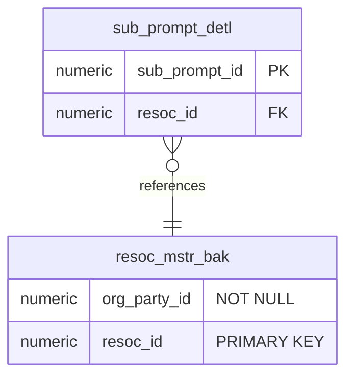

```
요약
발생일자 : 250702

이슈 : 연관 정보가 담겨있는 개별 테이블을 mermaid erdiagram으로 변환하여 병합하였을 때 그려질까에 대한 의문

결론 : 그려진다. 연관 정보에는 일방향 정보를 각각 가지고 있기 때문이다.
```


### `resoc_mstr_bak`
```json
[
  {"column_name": "org_party_id", "data_type": "numeric", "is_nullable": "NO", "constraint_type": null, "foreign_table_name": null, "foreign_column_name": null},
  {"column_name": "resoc_id", "data_type": "numeric", "is_nullable": "NO", "constraint_type": "PRIMARY KEY", "foreign_table_name": null, "foreign_column_name": null}
]
```


-> 아래의 테이블 정보를 mermaid erdiagram 그리기 위한 코드를 텍스트로 제공해줘. 단, 연관 정보까지 잘 포함하여 제공해줘.

mermaid erdiagram
```
erDiagram
resoc_mstr_bak {
numeric org_party_id "NOT NULL"
numeric resoc_id "PRIMARY KEY"
}
```


### `sub_prompt_detl`
```json
[
  {"column_name": "sub_prompt_id", "data_type": "numeric", "is_nullable": "NO", "constraint_type": "PRIMARY KEY", "foreign_table_name": null, "foreign_column_name": null},
  {"column_name": "resoc_id", "data_type": "numeric", "is_nullable": "NO", "constraint_type": "FOREIGN KEY", "foreign_table_name": "resoc_mstr_bak", "foreign_column_name": "resoc_id"}
]
```

프롬프트
```text
아래의 테이블 정보를 mermaid 영역에 넣기 위한 코드를 마크다운 문법없이 텍스트로 제공해줘

단, 연관 정보까지 잘 포함하여 제공해주되 해당 테이블 외의 다른 테이블의 정보는 생략해줘.


`sub_prompt_detl`
[
  {"column_name": "sub_prompt_id", "data_type": "numeric", "is_nullable": "NO", "constraint_type": "PRIMARY KEY", "foreign_table_name": null, "foreign_column_name": null},
  {"column_name": "resoc_id", "data_type": "numeric", "is_nullable": "NO", "constraint_type": "FOREIGN KEY", "foreign_table_name": "resoc_mstr_bak", "foreign_column_name": "resoc_id"}
]
```

응답
```text
erDiagram
    sub_prompt_detl {
        numeric sub_prompt_id PK
        numeric resoc_id FK
    }
    resoc_mstr_bak {
        numeric resoc_id PK
    }
    sub_prompt_detl }o--|| resoc_mstr_bak : "references"
```





## 중복테이블명 삭제, null 정보 삭제 버전
```mermaid
erDiagram    
CHMM_BUTTON_INFO {        BUTTON_ID PK    }    CATEGORY_ID {        CATEGORY_ID PK    }    CODE_ID {        CODE_ID PK    }    CODE_ITEM_ID {        CODE_ITEM_ID PK    }    EXCEPTION_LOG_ID {        EXCEPTION_LOG_ID PK    }    FILE_DOWNLOAD_CODE {        FILE_DOWNLOAD_CODE PK    }    FILE_METADATA_CODE {        FILE_METADATA_CODE PK    }    GROUP_ID {        GROUP_ID PK    }    ROLE_ID {        ROLE_ID PK    }    LANGUAGE_CODE {        LANGUAGE_CODE PK    }    COUNTRY_CODE {        COUNTRY_CODE PK    }    PATTERN_ID {        PATTERN_ID PK    }    MENU_ID {        MENU_ID PK    }    PARENT_ROLE_ID {        PARENT_ROLE_ID PK    }    CHILD_ROLE_ID {        CHILD_ROLE_ID PK    }    PARENT_GROUP_ID {        PARENT_GROUP_ID PK    }    CHILD_GROUP_ID {        CHILD_GROUP_ID PK    }    SERVICE_ID {        SERVICE_ID PK    }    CHMM_PERFORM_HIS_ID {        CHMM_PERFORM_HIS_ID PK    }    LABEL {        LABEL PK    }    PROPERTY_KEY {        PROPERTY_KEY PK    }    RESOURCE_ID {        RESOURCE_ID PK    }    TEST_ASSERTION_CODE {        TEST_ASSERTION_CODE PK    }    TEST_KEY {        TEST_KEY PK    }    TEST_COMPARISON {        TEST_COMPARISON PK    }    SERVICE_URI {        SERVICE_URI PK    }    SCHEDULE_ID {        SCHEDULE_ID PK    }    RM_PATHS {        RM_PATHS PK    }    RM_METHOD {        RM_METHOD PK    }    CLIENTSYSTEM_ID {        CLIENTSYSTEM_ID PK    }    ENV_ID {        ENV_ID PK    }    USER_ID {        USER_ID PK    }    seq {        seq PK    }    dept_id {        dept_id PK    }    sequence {        sequence PK    }    trade_code {        trade_code PK    }    name {        name PK    }
```