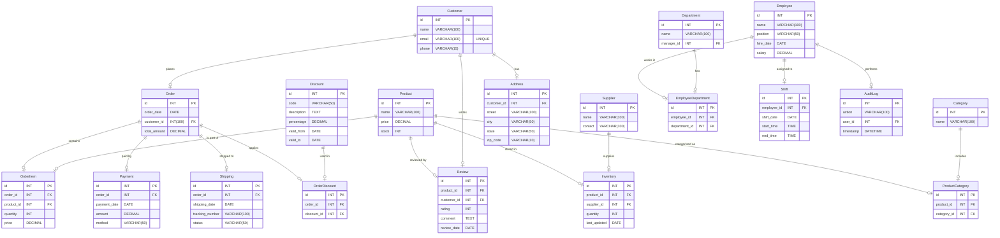
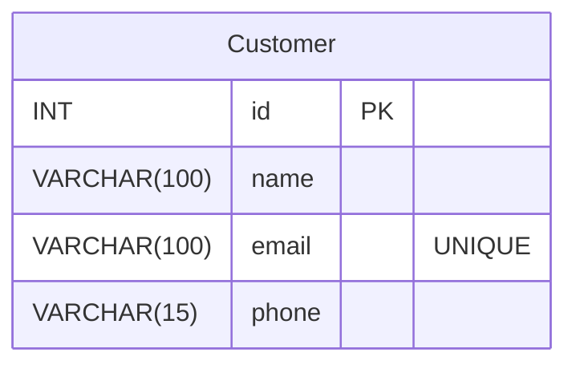

모두 그려진 결과를 봐야알 수 있음...


chatgpt 예시






```mermaid
erDiagram
Customer {
INT id
VARCHAR name
VARCHAR email
VARCHAR phone
}
Order {
INT id
DATE order_date
INT customer_id
DECIMAL(10,2) total_amount
}
Customer ||--o{ Order : "places"

```