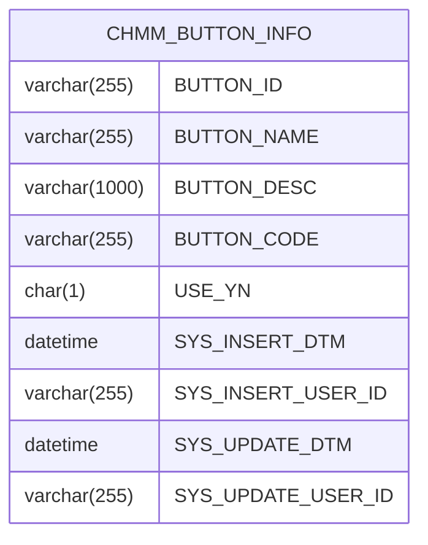
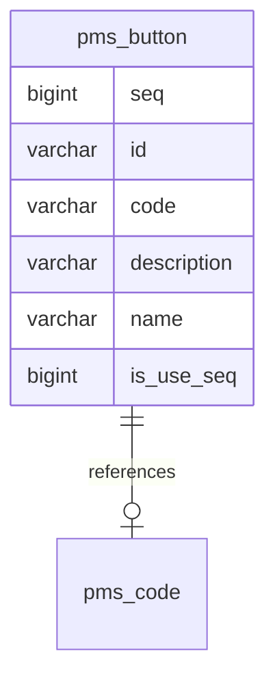
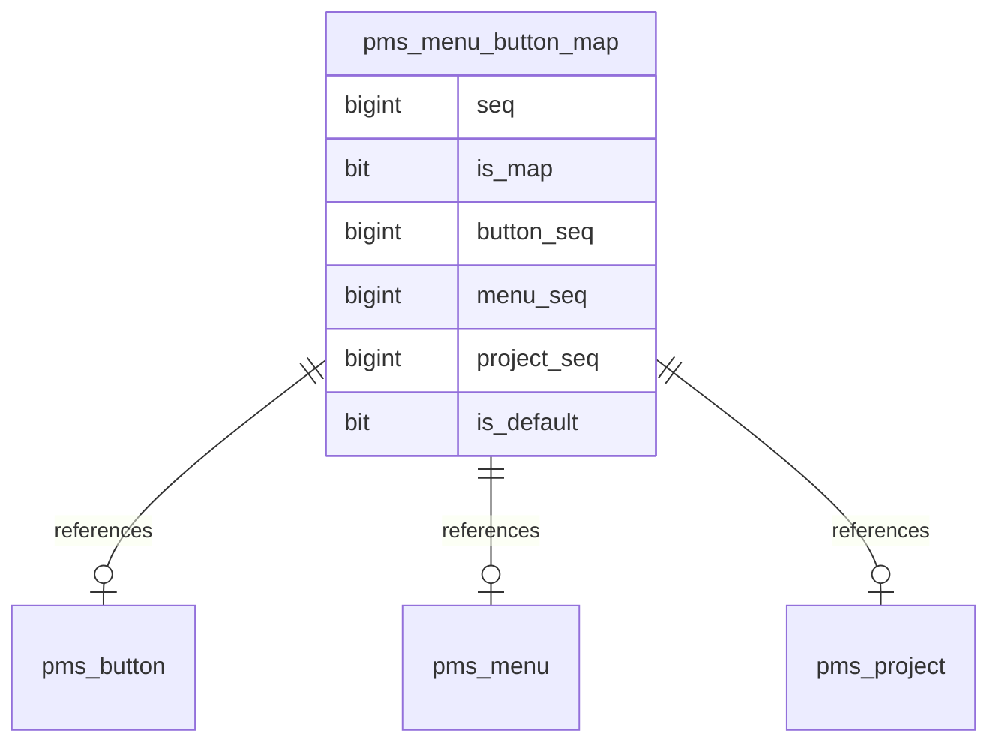

## 테이블명 삭제, null 정보 삭제
아래 테이블 정보를 mermaid 코드를 코드블록코드에 작성하지 않고 제공해줘 (추가정보 : cn-컬럼명, ct-컬럼타입) chmm_button_info {"cn":"BUTTON_ID","ct":"varchar(255)"},{"cn":"BUTTON_NAME","ct":"varchar(255)"},{"cn":"BUTTON_DESC","ct":"varchar(1000)"},{"cn":"BUTTON_CODE","ct":"varchar(255)"},{"cn":"USE_YN","ct":"char(1)"},{"cn":"SYS_INSERT_DTM","ct":"datetime"},{"cn":"SYS_INSERT_USER_ID","ct":"varchar(255)"},{"cn":"SYS_UPDATE_DTM","ct":"datetime"},{"cn":"SYS_UPDATE_USER_ID","ct":"varchar(255)"}




## 연관 테이블 테스트

[불필요정보삭제전]
```
{"tn":"pms_button","cn":"seq","ct":"bigint","rtn":null,"rcn":null},{"tn":"pms_button","cn":"id","ct":"varchar(255)","rtn":null,"rcn":null},{"tn":"pms_button","cn":"code","ct":"varchar(255)","rtn":null,"rcn":null},{"tn":"pms_button","cn":"description","ct":"varchar(255)","rtn":null,"rcn":null},{"tn":"pms_button","cn":"name","ct":"varchar(255)","rtn":null,"rcn":null},{"tn":"pms_button","cn":"is_use_seq","ct":"bigint","rtn":"pms_code","rcn":"seq"}


{"tn":"pms_menu_button_map","cn":"seq","ct":"bigint","rtn":null,"rcn":null},{"tn":"pms_menu_button_map","cn":"is_map","ct":"bit(1)","rtn":null,"rcn":null},{"tn":"pms_menu_button_map","cn":"button_seq","ct":"bigint","rtn":"pms_button","rcn":"seq"},{"tn":"pms_menu_button_map","cn":"menu_seq","ct":"bigint","rtn":"pms_menu","rcn":"seq"},{"tn":"pms_menu_button_map","cn":"project_seq","ct":"bigint","rtn":"pms_project","rcn":"seq"},{"tn":"pms_menu_button_map","cn":"is_default","ct":"bit(1)","rtn":null,"rcn":null}
```

[불필요정보삭제후]
```
pms_button
{"cn":"seq","ct":"bigint"},{"cn":"id","ct":"varchar(255)"},{"cn":"code","ct":"varchar(255)"},{"cn":"description","ct":"varchar(255)"},{"cn":"name","ct":"varchar(255)"},{"cn":"is_use_seq","ct":"bigint","rtn":"pms_code","rcn":"seq"}

pms_menu_button_map
{"cn":"seq","ct":"bigint"},{"cn":"is_map","ct":"bit(1)"},{"cn":"button_seq","ct":"bigint","rtn":"pms_button","rcn":"seq"},{"cn":"menu_seq","ct":"bigint","rtn":"pms_menu","rcn":"seq"},{"cn":"project_seq","ct":"bigint","rtn":"pms_project","rcn":"seq"},{"cn":"is_default","ct":"bit(1)"}
```

[프롬프트]
```
아래 테이블 정보를 mermaid 코드를 코드블록코드에 작성하지 않고 제공해줘 (추가정보 : cn-컬럼명, ct-컬럼타입, rtn-참조테이블명, rcn-참조컬럼명) 
```

[답변] => 실패
```
다음은 주어진 테이블 정보를 Mermaid.js 형식으로 변환한 텍스트입니다:

테이블명: pms_button
컬럼 정보:
seq: 타입 bigint
id: 타입 varchar(255)
code: 타입 varchar(255)
description: 타입 varchar(255)
name: 타입 varchar(255)
is_use_seq: 타입 bigint, 참조 테이블 pms_code, 참조 컬럼 seq
```

[프롬프트 수정]
```
아래 테이블 정보를 mermaid erdiagram 코드로 코드블록코드에 작성하지 않고 텍스트로 제공해줘. 연관 관계도 포함해서 그려지게 작성해줘.
(추가정보 : cn-컬럼명, ct-컬럼타입, rtn-참조테이블명, rcn-참조컬럼명) 
```

[첫번째 테이블 AI응답] => 원하는 정보가 포함됨. 단, 정제 필요
```
다음은 테이블 pms_button 정보를 Mermaid ER Diagram 형식으로 변환한 텍스트입니다. 연관 관계를 포함하여 작성되었습니다.

Mermaid ER Diagram 구조 텍스트

테이블 정의:

테이블 pms_button:

컬럼:
seq: 타입 bigint
id: 타입 varchar(255)
code: 타입 varchar(255)
description: 타입 varchar(255)
name: 타입 varchar(255)
is_use_seq: 타입 bigint, 참조 테이블 pms_code, 참조 컬럼 seq
테이블 pms_code:

컬럼:
seq: 타입 bigint
관계 정의:

pms_button.is_use_seq → pms_code.seq (1:N 관계)
이 텍스트를 Mermaid ER Diagram 코드로 변환하면 다음과 같은 구조를 가질 수 있습니다:

erDiagram
pms_button {
bigint seq
varchar id
varchar code
varchar description
varchar name
bigint is_use_seq
}
pms_code {
bigint seq
}
pms_button ||--o| pms_code : references
위 텍스트를 기반으로 Mermaid ER Diagram을 그릴 수 있습니다.
```

[mermaid] => 적절




[두번째 테이블 AI응답]
```
다음은 테이블 pms_menu_button_map 정보를 Mermaid ER Diagram 형식으로 변환한 텍스트입니다. 연관 관계를 포함하여 작성되었습니다.

Mermaid ER Diagram 구조 텍스트

테이블 정의:

테이블 pms_menu_button_map:

컬럼:
seq: 타입 bigint
is_map: 타입 bit(1)
button_seq: 타입 bigint, 참조 테이블 pms_button, 참조 컬럼 seq
menu_seq: 타입 bigint, 참조 테이블 pms_menu, 참조 컬럼 seq
project_seq: 타입 bigint, 참조 테이블 pms_project, 참조 컬럼 seq
is_default: 타입 bit(1)
테이블 pms_button:

컬럼:
seq: 타입 bigint
테이블 pms_menu:

컬럼:
seq: 타입 bigint
테이블 pms_project:

컬럼:
seq: 타입 bigint
관계 정의:

pms_menu_button_map.button_seq → pms_button.seq (1:N 관계)
pms_menu_button_map.menu_seq → pms_menu.seq (1:N 관계)
pms_menu_button_map.project_seq → pms_project.seq (1:N 관계)
이 텍스트를 Mermaid ER Diagram 코드로 변환하면 다음과 같은 구조를 가질 수 있습니다:

erDiagram
pms_menu_button_map {
bigint seq
bit is_map
bigint button_seq
bigint menu_seq
bigint project_seq
bit is_default
}
pms_button {
bigint seq
}
pms_menu {
bigint seq
}
pms_project {
bigint seq
}
pms_menu_button_map ||--o| pms_button : references
pms_menu_button_map ||--o| pms_menu : references
pms_menu_button_map ||--o| pms_project : references
위 텍스트를 기반으로 Mermaid ER Diagram을 그릴 수 있습니다.
```

