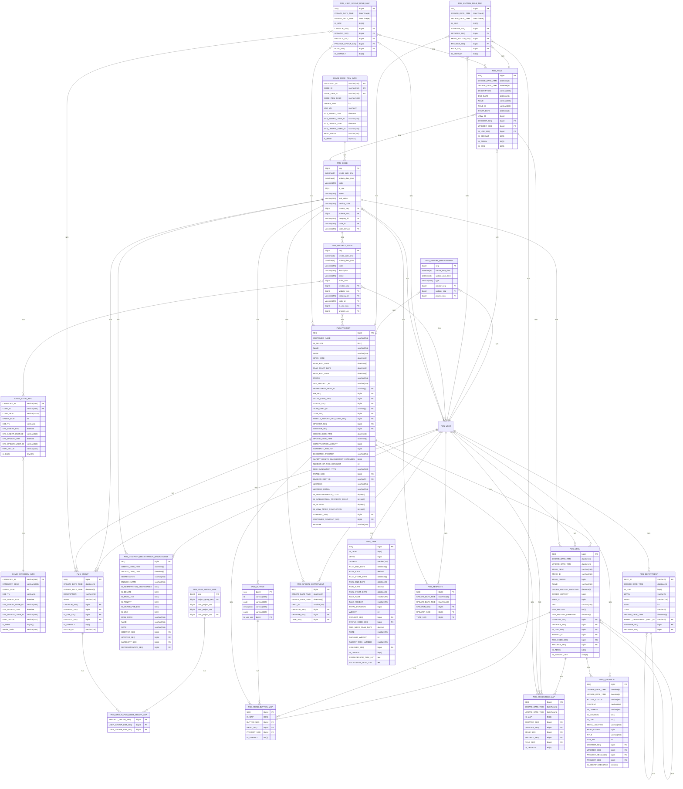

```mermaid
erDiagram


CHMM_CATEGORY_INFO {
        CATEGORY_ID varchar(255) PK
        CATEGORY_DESC varchar(1000)
        ORDER_NUM int
        USE_YN varchar(1)
        SYS_INSERT_DTM datetime
        SYS_INSERT_USER_ID varchar(255)
        SYS_UPDATE_DTM datetime
        SYS_UPDATE_USER_ID varchar(255)
        REAL_VALUE varchar(100)
        is_delete tinyint(1)
        service_code varchar(255)
    }

CHMM_CODE_INFO {
        CATEGORY_ID varchar(255) PK
        CODE_ID varchar(255) PK
        CODE_DESC varchar(1000)
        ORDER_NUM int
        USE_YN varchar(1)
        SYS_INSERT_DTM datetime
        SYS_INSERT_USER_ID varchar(255)
        SYS_UPDATE_DTM datetime
        SYS_UPDATE_USER_ID varchar(255)
        REAL_VALUE varchar(100)
        is_delete tinyint(1)
    }

CHMM_CODE_ITEM_INFO {
        CATEGORY_ID varchar(255) PK
        CODE_ID varchar(255) PK
        CODE_ITEM_ID varchar(255) PK
        CODE_ITEM_DESC varchar(1000)
        ORDER_NUM int
        USE_YN varchar(1)
        SYS_INSERT_DTM datetime
        SYS_INSERT_USER_ID varchar(255)
        SYS_UPDATE_DTM datetime
        SYS_UPDATE_USER_ID varchar(255)
        REAL_VALUE varchar(100)
        is_delete tinyint(1)
    }

PMS_BUTTON {
         seq bigint PK
         id varchar(255)
         code varchar(255)
         description varchar(255)
         name varchar(255)
         is_use_seq bigint FK
    }

PMS_BUTTON_ROLE_MAP {
        SEQ BigInt PK
        CREATE_DATE_TIME DateTime(6)
        UPDATE_DATE_TIME DateTime(6)
        IS_MAP Bit(1)
        CREATOR_SEQ BigInt FK
        UPDATER_SEQ BigInt FK
        MENU_BUTTON_SEQ BigInt FK
        PROJECT_SEQ BigInt FK
        ROLE_SEQ BigInt FK
        IS_DEFAULT Bit(1)
    }

PMS_CODE {
        bigint seq PK
        datetime(6) create_date_time
        datetime(6) update_date_time
        varchar(255) code
        bit(1) is_use
        varchar(255) name
        varchar(255) real_value
        varchar(255) service_code
        bigint creator_seq FK
        bigint updater_seq FK
        varchar(255) category_id FK
        varchar(255) code_id FK
        varchar(255) code_item_id FK
    }

PMS_COMPANY_REGISTRATION_MANAGEMENT {
        SEQ bigint PK
        CREATE_DATE_TIME datetime(6)
        UPDATE_DATE_TIME datetime(6)
        ABBREVIATION varchar(255)
        ENGLISH_NAME varchar(255)
        IS_ABBREVIATION_CHANGEABLE bit(1)
        IS_DELETE bit(1)
        IS_MOIN_USE bit(1)
        IS_TENANT bit(1)
        IS_USAGE_FEE_END bit(1)
        IS_USE bit(1)
        MOIN_CODE varchar(255)
        NAME varchar(255)
        NOTE varchar(255)
        CREATOR_SEQ bigint FK
        UPDATER_SEQ bigint FK
        CATEGORY_SEQ bigint FK
        REPRESENTATIVE_SEQ bigint FK
    }

PMS_DEPARTMENT {
        DEPT_ID varchar(5) PK
        CREATE_DATE_TIME datetime(6)
        IS_USE bit(1)
        LEVEL varchar(5)
        NAME varchar(100)
        SORT int
        TYPE varchar(5)
        UPDATE_DATE_TIME datetime(6)
        PARENT_DEPARTMENT_DEPT_ID varchar(5) FK
        CREATOR_SEQ bigint FK
        UPDATER_SEQ bigint FK
    }

PMS_EXPORT_MANAGEMENT {
        bigint seq PK
        datetime(6) create_date_time
        datetime(6) update_date_time
        varchar(255) type
        bigint creator_seq FK
        bigint updater_seq FK
        bigint project_seq FK
    }

PMS_GROUP {
        SEQ bigint PK
        CREATE_DATE_TIME datetime(6)
        UPDATE_DATE_TIME datetime(6)
        DESCRIPTION varchar(255)
        NAME varchar(255)
        CREATOR_SEQ bigint FK
        UPDATER_SEQ bigint FK
        IS_USE_SEQ bigint FK
        PROJECT_SEQ bigint FK
        IS_DEFAULT bit(1)
        GROUP_ID varchar(255)
    }

PMS_GROUP_PMS_USER_GROUP_MAP {
        PROJECT_GROUP_SEQ bigint FK
        USER_GROUP_LIST_SEQ bigint PK
        USER_GROUP_LIST_SEQ bigint PK
    }

PMS_MENU {
        SEQ bigint PK
        CREATE_DATE_TIME datetime(6)
        UPDATE_DATE_TIME datetime(6)
        MENU_DESC varchar(255)
        MENU_ID varchar(255)
        MENU_ORDER bigint
        NAME varchar(255)
        ORDER_HISTORY_DATETIME datetime(6)
        ORDER_HISTROY bigint
        TREE_ID bigint
        URL varchar(255)
        USE_HISTORY bit(1)
        USE_HISTORY_DATETIME datetime(6)
        CREATOR_SEQ bigint FK
        UPDATER_SEQ bigint FK
        IS_USE_SEQ bigint FK
        PARENT_ID bigint FK
        PMS_CODE_SEQ bigint FK
        PROJECT_SEQ bigint FK
        IS_ADMIN bit(1)
        IS_MANUAL_USE char(1)
    }

PMS_MENU_BUTTON_MAP {
        SEQ BigInt PK
        IS_MAP Bit(1)
        BUTTON_SEQ BigInt FK
        MENU_SEQ BigInt FK
        PROJECT_SEQ BigInt FK
        IS_DEFAULT Bit(1)
    }

PMS_MENU_ROLE_MAP {
        SEQ BigInt PK
        CREATE_DATE_TIME DateTime(6)
        UPDATE_DATE_TIME DateTime(6)
        IS_MAP Bit(1)
        CREATOR_SEQ BigInt FK
        UPDATER_SEQ BigInt FK
        MENU_SEQ BigInt FK
        PROJECT_SEQ BigInt FK
        ROLE_SEQ BigInt FK
        IS_DEFAULT Bit(1)
    }

PMS_PROJECT {
        SEQ bigint PK
        CUSTOMER_NAME varchar(255)
        IS_DELETE bit(1)
        NAME varchar(255)
        NOTE varchar(255)
        OPEN_DATE datetime(6)
        PLAN_END_DATE datetime(6)
        PLAN_START_DATE datetime(6)
        REAL_END_DATE datetime(6)
        PREFIX varchar(255)
        SAP_PROJECT_ID varchar(255)
        DEPARTMENT_DEPT_ID varchar(5) FK
        PM_SEQ bigint FK
        SALES_USER_SEQ bigint FK
        STATUS_SEQ bigint FK
        TEAM_DEPT_ID varchar(5) FK
        TYPE_SEQ bigint FK
        WEEKLY_REPORT_DAY_CODE_SEQ bigint FK
        UPDATER_SEQ bigint FK
        CREATOR_SEQ bigint FK
        CREATE_DATE_TIME datetime(6)
        UPDATE_DATE_TIME datetime(6)
        CONSTRUCTION_AMOUNT bigint
        CONTRACT_AMOUNT bigint
        EXECUTION_POSITION varchar(255)
        SAFETY_HEALTH_MANAGEMENT_EXPENSES bigint
        NUMBER_OF_RISK_CONDUCT int
        RISK_EVALUATION_TYPE varchar(100)
        PHASE_SEQ bigint FK
        DIVISION_DEPT_ID varchar(5) FK
        ADDRESS varchar(255)
        ADDRESS_DETAIL varchar(255)
        IS_IMPLEMENTATION_COST tinyint(1)
        IS_INTELLECTUAL_PROPERTY_RIGHT tinyint(1)
        IS_LICENSE tinyint(1)
        IS_VIEW_AFTER_COMPLETION tinyint(1)
        COMPANY_SEQ bigint FK
        CUSTOMER_COMPANY_SEQ bigint FK
        REMARK varchar(100)
    }

PMS_PROJECT_CODE {
        bigint seq PK
        datetime(6) create_date_time
        datetime(6) update_date_time
        varchar(255) code
        varchar(255) description
        varchar(255) name
        bigint order_num
        bigint creator_seq FK
        bigint updater_seq FK
        varchar(255) category_id FK
        varchar(255) code_id FK
        bigint is_use_seq FK
        bigint project_seq FK
    }

PMS_QUESTION {
        SEQ bigint PK
        CREATE_DATE_TIME datetime(6)
        UPDATE_DATE_TIME datetime(6)
        ACTION_STATUS varchar(30)
        CONTENT mediumblob
        IN_CHARGE varchar(30)
        IS_COMMON bit(1)
        IS_USE bit(1)
        MENU_LOCATION varchar(255)
        READ_COUNT bigint
        TITLE varchar(255)
        TOP_PIN int
        CREATOR_SEQ bigint FK
        UPDATER_SEQ bigint FK
        PROJECT_MENU_SEQ bigint FK
        PROJECT_SEQ bigint FK
        IS_SECRET_MESSAGE tinyint(1)
    }

PMS_ROLE {
        SEQ bigint PK
        CREATE_DATE_TIME datetime(6)
        UPDATE_DATE_TIME datetime(6)
        DESCRIPTION varchar(255)
        END_DATE datetime(6)
        NAME varchar(255)
        ROLE_ID varchar(255)
        START_DATE datetime(6)
        VIEW_ID bigint
        CREATOR_SEQ bigint FK
        UPDATER_SEQ bigint FK
        IS_USE_SEQ bigint FK
        IS_DEFAULT bit(1)
        IS_ADMIN bit(1)
        IS_QRS bit(1)
    }

PMS_SPECIAL_DEPARTMENT {
        SEQ bigint PK
        CREATE_DATE_TIME datetime(6)
        UPDATE_DATE_TIME datetime(6)
        DEPT_ID varchar(255)
        CREATOR_SEQ bigint FK
        UPDATER_SEQ bigint FK
        TYPE_SEQ bigint FK
    }

PMS_TASK {
        SEQ bigint PK
        IS_LEAF bit(1)
        LEVEL bigint
        OUTPUT varchar(255)
        PLAN_END_DATE datetime(6)
        PLAN_RATE decimal
        PLAN_START_DATE datetime(6)
        REAL_END_DATE datetime(6)
        REAL_RATE decimal
        REAL_START_DATE datetime(6)
        TASK_NAME varchar(255)
        TASK_NUMBER varchar(255)
        TOTAL_DURATION bigint
        WEIGHT int
        PROJECT_SEQ bigint FK
        STATUS_CODE_SEQ bigint FK
        THIS_WEEK_PLAN_RATE decimal
        NOTE varchar(255)
        PACKAGE_WEIGHT int
        PARENT_TASK_NUMBER varchar(255)
        ASSIGNEE_SEQ bigint FK
        IS_UPDATE bit(1)
        PREDECESSOR_TASK_LIST text
        SUCCESSOR_TASK_LIST text
    }

PMS_TEMPLATE {
        SEQ BigInt PK
        CREATE_DATE_TIME DateTime(6)
        UPDATE_DATE_TIME DateTime(6)
        CREATOR_SEQ BigInt FK
        UPDATER_SEQ BigInt FK
        TYPE_SEQ BigInt FK
    }

PMS_USER_GROUP_MAP {
        bigint seq PK
        bigint project_group_seq FK
        bigint user_project_seq
        bigint user_project_seq
        bigint user_project_seq FK
    }

PMS_USER_GROUP_ROLE_MAP {
        SEQ BigInt PK
        CREATE_DATE_TIME DateTime(6)
        UPDATE_DATE_TIME DateTime(6)
        IS_MAP Bit(1)
        CREATOR_SEQ BigInt FK
        UPDATER_SEQ BigInt FK
        PROJECT_SEQ BigInt FK
        PROJECT_GROUP_SEQ BigInt FK
        ROLE_SEQ BigInt FK
        IS_DEFAULT Bit(1)
    }
PMS_MENU ||--O{ PMS_MENU_ROLE_MAP : "N:N"
PMS_USER ||--O{ PMS_MENU_ROLE_MAP : "N:N"
PMS_ROLE ||--O{ PMS_MENU_ROLE_MAP : "N:N"
PMS_PROJECT ||--O{ PMS_MENU_ROLE_MAP : "N:N"
PMS_USER ||--O{ PMS_CODE : "N:N"
CHMM_CODE_ITEM_INFO ||--O{ PMS_CODE : "N:N"
PMS_USER ||--O{ PMS_SPECIAL_DEPARTMENT : "N:N"
PMS_CODE ||--O{ PMS_SPECIAL_DEPARTMENT : "N:N"
PMS_CODE ||--O{ PMS_BUTTON : "N:N"
PMS_USER ||--O{ PMS_COMPANY_REGISTRATION_MANAGEMENT : "N:N"

PMS_COMPANY_REGISTRATION_MANAGEMENT }O--|| PMS_CODE : "N:N"
PMS_EXPORT_MANAGEMENT }O--|| PMS_PROJECT : "N:N"
PMS_EXPORT_MANAGEMENT }O--|| PMS_USER : "N:N"
CHMM_CODE_INFO }O--|| CHMM_CATEGORY_INFO : "N:N"
PMS_ROLE }O--|| PMS_CODE : "N:N"
PMS_ROLE }O--|| PMS_USER : "N:N"
PMS_BUTTON_ROLE_MAP }O--|| PMS_MENU_BUTTON_MAP : "N:N"
PMS_BUTTON_ROLE_MAP }O--|| PMS_USER : "N:N"
PMS_BUTTON_ROLE_MAP }O--|| PMS_ROLE : "N:N"
PMS_BUTTON_ROLE_MAP }O--|| PMS_PROJECT : "N:N"

PMS_USER ||--O{ PMS_GROUP : "N:N"
PMS_CODE ||--O{ PMS_GROUP : "N:N"
PMS_PROJECT ||--O{ PMS_GROUP : "N:N"
PMS_USER ||--O{ PMS_DEPARTMENT : "N:N"
PMS_DEPARTMENT ||--O{ PMS_DEPARTMENT : "N:N"
PMS_MENU ||--O{ PMS_MENU_BUTTON_MAP : "N:N"
PMS_BUTTON ||--O{ PMS_MENU_BUTTON_MAP : "N:N"
PMS_PROJECT ||--O{ PMS_MENU_BUTTON_MAP : "N:N"
PMS_USER ||--O{ PMS_QUESTION : "N:N"
PMS_MENU ||--O{ PMS_QUESTION : "N:N"


PMS_USER ||--O{ PMS_TASK : "N:N"
PMS_PROJECT ||--O{ PMS_MENU : "N:N"
PMS_USER ||--O{ PMS_MENU : "N:N"
PMS_MENU ||--O{ PMS_MENU : "N:N"
PMS_CODE ||--O{ PMS_MENU : "N:N"
PMS_USER ||--O{ PMS_TEMPLATE : "N:N"
PMS_CODE ||--O{ PMS_TEMPLATE : "N:N"
PMS_USER_GROUP_MAP ||--O{ PMS_GROUP_PMS_USER_GROUP_MAP : "N:N"
PMS_GROUP ||--O{ PMS_GROUP_PMS_USER_GROUP_MAP : "N:N"
PMS_CODE ||--O{ PMS_PROJECT_CODE : "N:N"

PMS_PROJECT_CODE }O--O{ PMS_USER : "N:N"
PMS_PROJECT_CODE }O--O{ CHMM_CODE_INFO : "N:N"
PMS_PROJECT_CODE }O--O{ PMS_PROJECT : "N:N"
PMS_USER_GROUP_ROLE_MAP }O--O{ PMS_GROUP : "N:N"
PMS_USER_GROUP_ROLE_MAP }O--O{ PMS_PROJECT : "N:N"
PMS_USER_GROUP_ROLE_MAP }O--O{ PMS_USER : "N:N"
PMS_USER_GROUP_ROLE_MAP }O--O{ PMS_ROLE : "N:N"

```
