resoc_mstr_bak
```mermaid
erDiagram
    RESOC_MSTR_BAK {
        numeric org_party_id
        numeric resoc_id
        timestamp hist_str_date
        timestamp hist_end_date
        numeric up_resoc_id
        character resoc_gubun_code
        character resoc_name
        character resoc_alt_name
        character resoc_coment
        character resoc_add_info
        character resoc_descrt
        numeric crt_party_id
        integer sort_seq
        character code_column_yn
        character data_type
        integer data_len
        integer data_prcsin
        integer data_scale
        character null_yn
        character defult_value
        integer column_seq
        character pk_yn
        character fk_yn
        character code_value
        character chart_ref_id
        text query_cntnt
        character query_result_header
        character menu_url
    }
note right of RESOC_MSTR_BAK : this is a short explanation
```

sub_prompt_detl
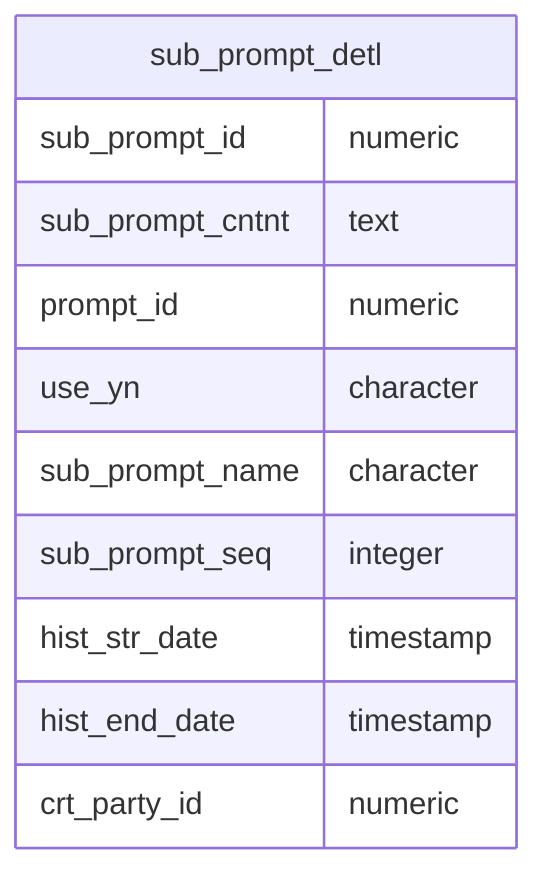

party_role_rel
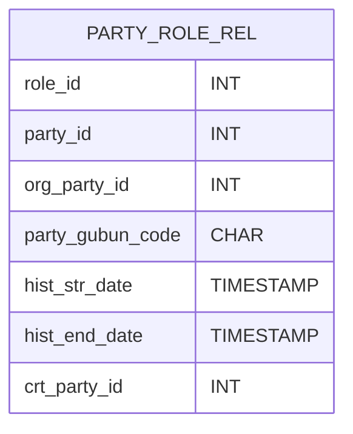

ai_chat_mstr
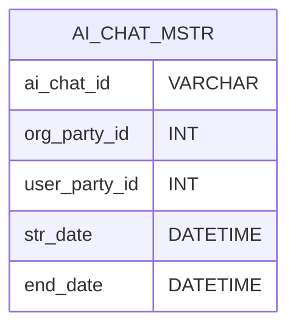

role_resoc_rel
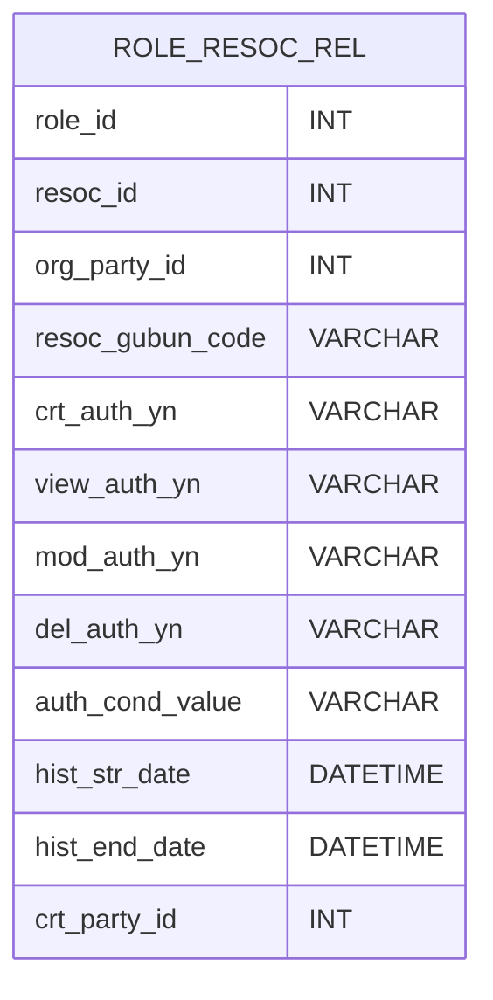

resoc_mstr
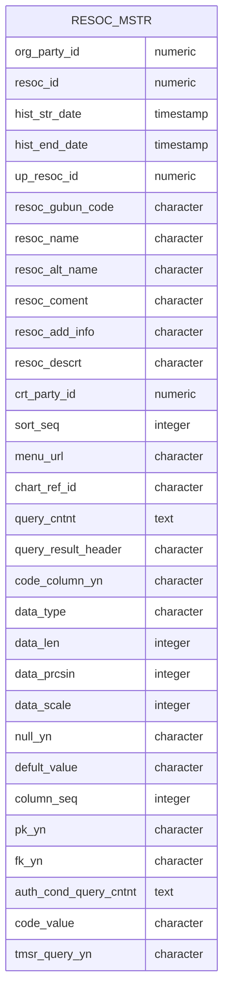

prcs_log
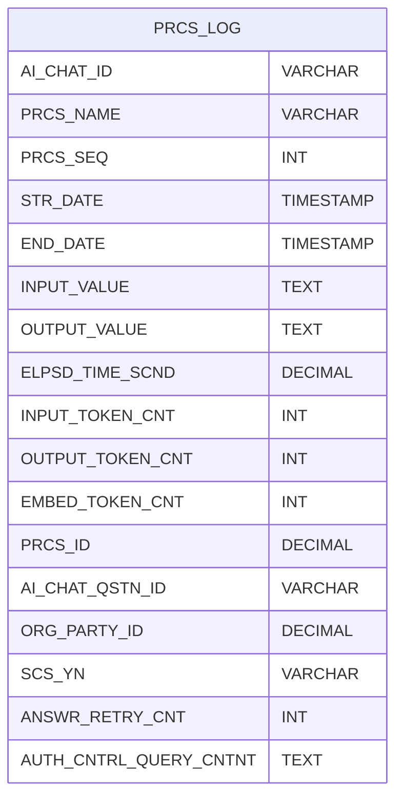

role_mstr
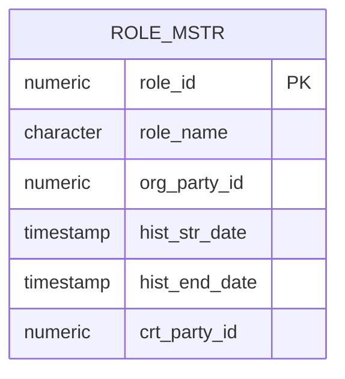

party_rel
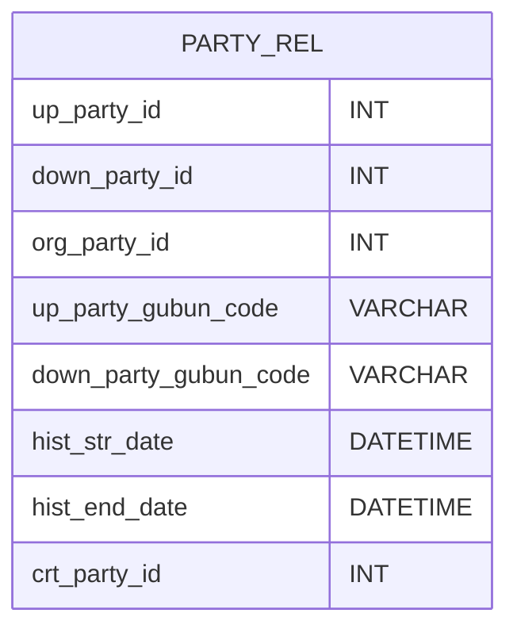

ai_qstn_mstr
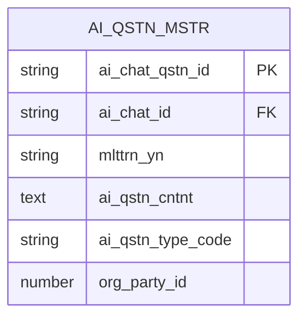

resoc_rel
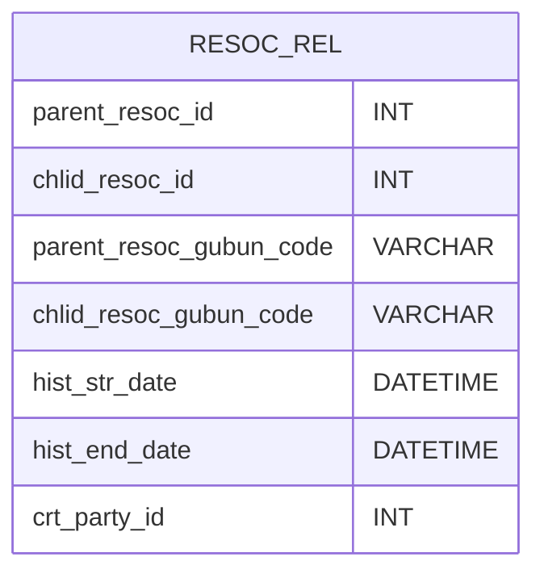

prompt_mstr
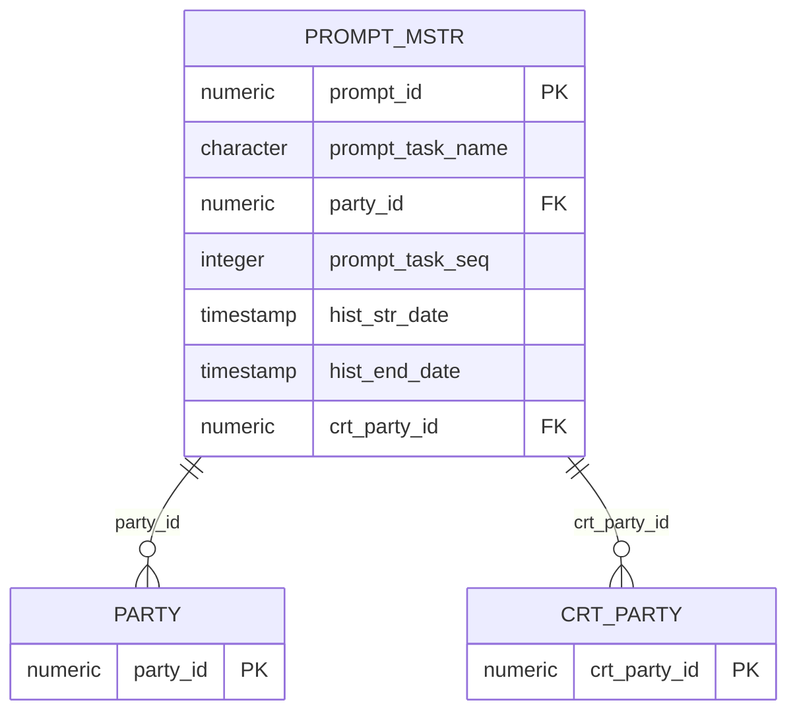

qstn_gd_list
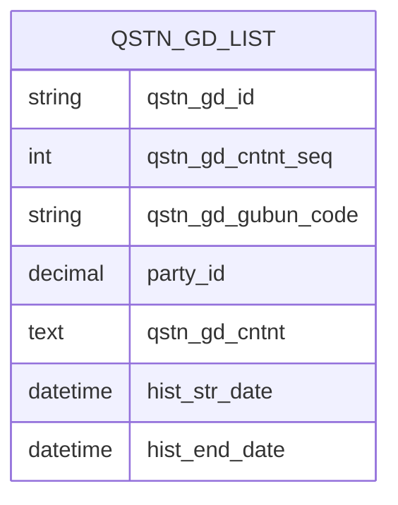

ai_answr_eval_record
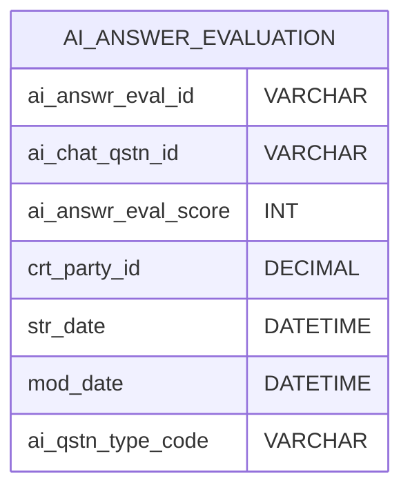

prdt_mstr
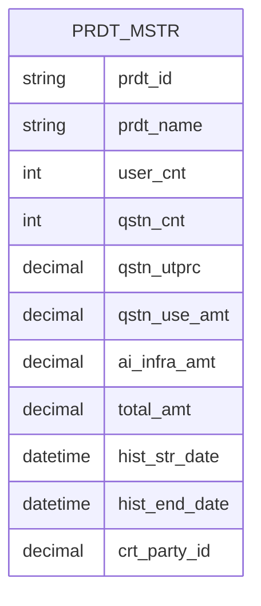

settle_mstr
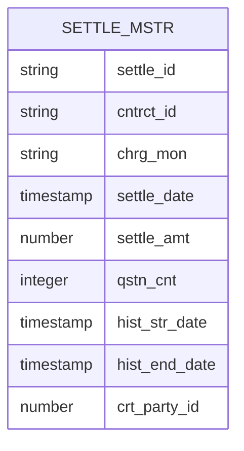

srvc_record
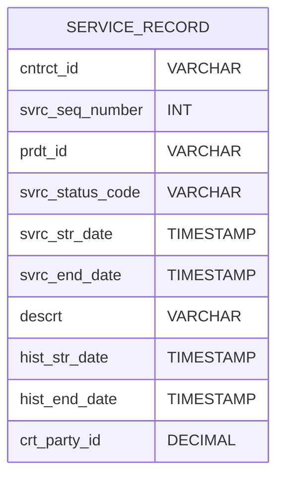

trmn_glsry
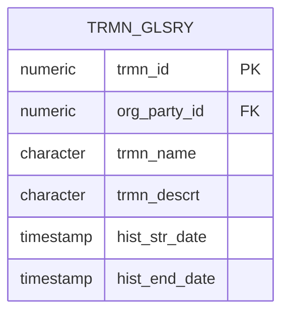

party_mstr
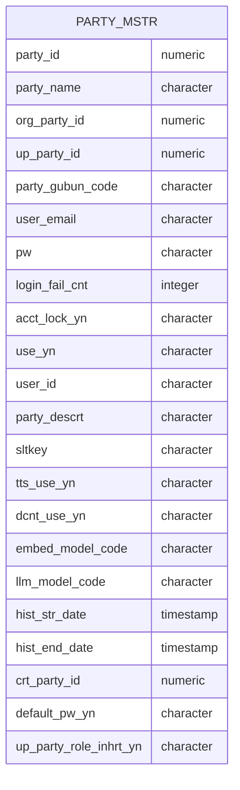

cntrct_mstr
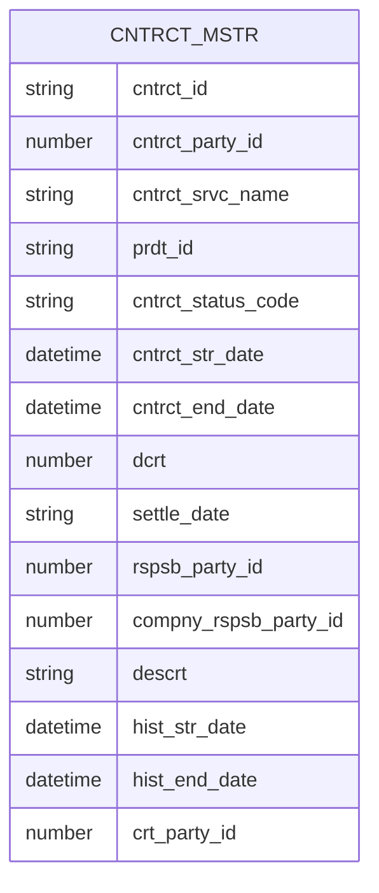


```mermaid
erDiagram
abc
```