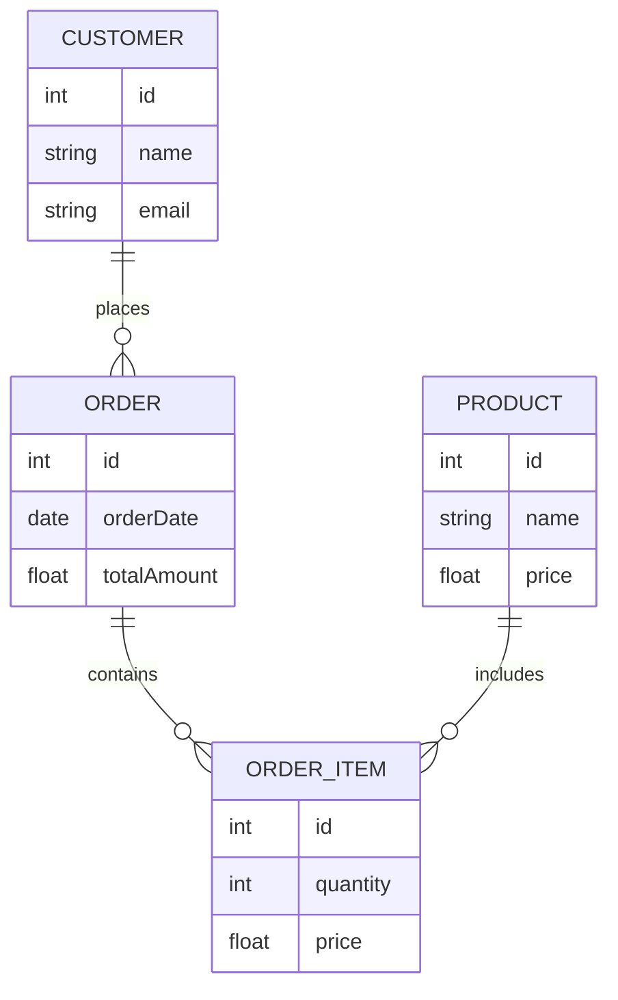

# prisma 사용 목적


```
erDiagram
    CUSTOMER {
        int id
        string name
        string email
    }
    
    ORDER {
        int id
        date orderDate
        float totalAmount
    }
    
    PRODUCT {
        int id
        string name
        float price
    }
    
    ORDER_ITEM {
        int id
        int quantity
        float price
    }
    
    CUSTOMER ||--o{ ORDER : places
    ORDER ||--o{ ORDER_ITEM : contains
    PRODUCT ||--o{ ORDER_ITEM : includes
```





- `CUSTOMER` 테이블은 계정 생성, 프로필 업데이트, 주문 내역 보기 등의 기능을 가지고 있으며, 이와 관련된 모듈로 `AccountModule`, `ProfileModule`, `OrderHistoryModule`이 있습니다.
> **Customer**: 고객 정보를 저장하는 테이블입니다.
    - `id`: 고유 식별자
    - `name`: 고객 이름
    - `email`: 고객 이메일 (고유)
    - `orders`: 고객이 한 주문 목록 (Order와의 관계)

> **AccountModule (계정 모듈)**
createAccount(): 새로운 사용자의 계정을 생성합니다. 사용자 이름, 이메일, 비밀번호 등의 정보를 입력받아 데이터베이스에 저장합니다.
deleteAccount(): 기존 사용자의 계정을 삭제합니다. 사용자 ID를 입력받아 해당 계정을 데이터베이스에서 제거합니다.
> **ProfileModule (프로필 모듈)**
updateProfile(): 사용자의 프로필 정보를 업데이트합니다. 사용자 이름, 이메일, 주소 등의 정보를 입력받아 데이터베이스에 저장합니다.
viewProfile(): 사용자의 프로필 정보를 조회합니다. 사용자 ID를 입력받아 해당 사용자의 프로필 정보를 반환합니다.
> **OrderHistoryModule (주문 내역 모듈)**
viewOrderHistory(): 사용자의 주문 내역을 조회합니다. 사용자 ID를 입력받아 해당 사용자의 모든 주문 내역을 반환합니다.
viewOrderDetails(orderId): 특정 주문의 상세 정보를 조회합니다. 주문 ID를 입력받아 해당 주문의 상세 정보를 반환합니다.

- `ORDER` 테이블은 주문하기, 주문 취소, 주문 추적 등의 기능을 가지고 있으며, 이와 관련된 모듈로 `OrderProcessingModule`, `OrderTrackingModule`이 있습니다.
> **OrderProcessingModule (주문 처리 모듈)**
placeOrder(): 새로운 주문을 생성합니다. 사용자 ID, 주문 항목, 총 금액 등의 정보를 입력받아 데이터베이스에 저장합니다.
cancelOrder(orderId): 기존 주문을 취소합니다. 주문 ID를 입력받아 해당 주문을 데이터베이스에서 취소 처리합니다.
> **OrderTrackingModule (주문 추적 모듈)**
trackOrder(orderId): 특정 주문의 배송 상태를 추적합니다. 주문 ID를 입력받아 해당 주문의 현재 배송 상태를 반환합니다.
updateOrderStatus(orderId, status): 특정 주문의 배송 상태를 업데이트합니다. 주문 ID와 새로운 상태를 입력받아 데이터베이스에 저장합니다.

- `PRODUCT` 테이블은 제품 추가, 제품 업데이트, 제품 상세 보기 등의 기능을 가지고 있으며, 이와 관련된 모듈로 `ProductManagementModule`, `ProductCatalogModule`이 있습니다.
> **ProductManagementModule (제품 관리 모듈)**
addProduct(): 새로운 제품을 추가합니다. 제품 이름, 가격, 설명 등의 정보를 입력받아 데이터베이스에 저장합니다.
updateProduct(productId): 기존 제품의 정보를 업데이트합니다. 제품 ID와 새로운 정보를 입력받아 데이터베이스에 저장합니다.
> **ProductCatalogModule (제품 카탈로그 모듈)**
viewProductDetails(productId): 특정 제품의 상세 정보를 조회합니다. 제품 ID를 입력받아 해당 제품의 상세 정보를 반환합니다.
listAllProducts(): 모든 제품의 목록을 조회합니다. 데이터베이스에서 모든 제품 정보를 반환합니다.

- `ORDER_ITEM` 테이블은 주문에 항목 추가, 주문에서 항목 제거, 항목 수량 업데이트 등의 기능을 가지고 있으며, 이와 관련된 모듈로 `OrderItemManagementModule`이 있습니다.
> **OrderItemManagementModule (주문 항목 관리 모듈)**
addItemToOrder(orderId, productId, quantity): 특정 주문에 제품을 추가합니다. 주문 ID, 제품 ID, 수량을 입력받아 데이터베이스에 저장합니다.
removeItemFromOrder(orderItemId): 특정 주문에서 제품을 제거합니다. 주문 항목 ID를 입력받아 해당 항목을 데이터베이스에서 제거합니다.
updateItemQuantity(orderItemId, quantity): 특정 주문 항목의 수량을 업데이트합니다. 주문 항목 ID와 새로운 수량을 입력받아 데이터베이스에 저장합니다.


